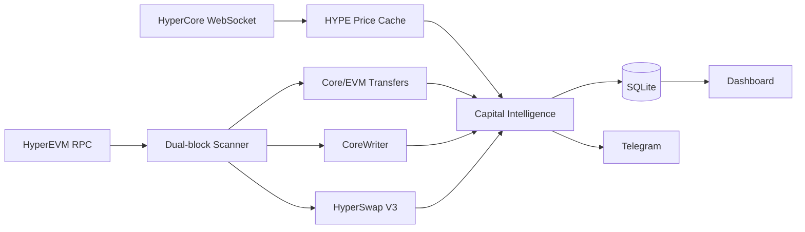

# HyperEVM Chain Radar V0.1.0

**中文 | English** — HyperEVM + HyperCore real-time capital-flow monitoring.

[中文说明](README.zh-CN.md) · [English README](README.en-US.md)

> Independent community project. Not affiliated with or endorsed by Hyperliquid or HyperSwap.

## V0.1.0 scope

- HyperEVM mainnet Chain ID `999`
- dual-block-aware EVM scanner
- HyperCore `allMids` WebSocket price stream
- HyperCore ↔ HyperEVM system-transfer detection
- CoreWriter call/action-ID monitoring
- HyperSwap V3 new-pool, swap, LP add/remove monitoring
- conservative USD estimation using native USDC / WHYPE anchors
- P0/P1 LP large-withdrawal radar
- SQLite persistence + dedupe
- Telegram alerts
- `/zh`, `/en`, `/api/health`, `/api/events`
- one-command `doctor.py`
- Android Termux + Ubuntu systemd deployment

## Architecture



## Quick start

Android / Termux:

```bash
pkg update
pkg install -y git
git clone https://github.com/yinchun6969/Hyperevm-chain-radar.git
cd Hyperevm-chain-radar
bash scripts/android/install-termux.sh
```

Ubuntu:

```bash
git clone https://github.com/yinchun6969/Hyperevm-chain-radar.git
cd Hyperevm-chain-radar
sudo bash scripts/ubuntu/install.sh
```

Dashboard: `http://127.0.0.1:8788/zh` · `http://127.0.0.1:8788/en`

## Monitoring semantics

- HyperEVM official JSON-RPC currently has no WebSocket JSON-RPC; EVM scanning uses HTTP polling.
- V0.1.0 uses one-block `eth_getLogs` windows, below HyperEVM's documented 50-block query maximum.
- HyperCore → HyperEVM HYPE system-transaction detection is marked best-effort.
- ERC20 Core ↔ EVM system-address transfers and HYPE EVM → Core `Received` logs are deterministic EVM observations.
- LP drain percentages use Radar-observed priced LP flow, not exact pool TVL.
- V0.1.0 discovers HyperSwap V3 pools from `PoolCreated`; historical pool bootstrapping is planned next.
- This is monitoring software, not an investment recommendation or smart-contract audit.

## Verified constants

- Chain ID `999`
- RPC `https://rpc.hyperliquid.xyz/evm`
- HYPE system `0x2222222222222222222222222222222222222222`
- CoreWriter `0x3333333333333333333333333333333333333333`
- WHYPE `0x5555555555555555555555555555555555555555`
- Native USDC `0xb88339CB7199b77E23DB6E890353E22632Ba630f`
- HyperSwap V3 Factory `0xB1c0fa0B789320044A6F623cFe5eBda9562602E3`

## License
MIT
