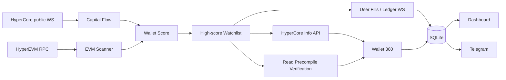

# HyperEVM Chain Radar V0.3.0

**中文 | English** — HyperEVM + HyperCore capital-flow, smart-money and Wallet 360 monitoring.

[中文说明](README.zh-CN.md) · [English README](README.en-US.md) · [V0.3.0 Release Notes](RELEASE_NOTES_V0.3.0.md)

> Independent community project. Not affiliated with or endorsed by Hyperliquid, HyperSwap, Etherscan, or any wallet/exchange provider.

## V0.3.0 — Wallet 360 Intelligence

V0.3.0 adds account-state intelligence on top of V0.2 smart-money flows:

**HyperCore trade → Core→EVM → HyperSwap BUY → LP → wallet score → HyperCore Spot/Perp/Vault state → Read Precompile verification → ongoing high-score wallet stream.**

### New in V0.3.0

- **Wallet 360 snapshots** for high-scoring wallets.
  - HyperCore `clearinghouseState`: account value, perp notional, margin, withdrawable, unrealized PnL and largest open position.
  - HyperCore `spotClearinghouseState`: HYPE / USDC and other spot balances.
  - `userVaultEquities`: observed vault equity.
- **Read Precompile verification** through HyperEVM `eth_call` with raw ABI arguments (no selector).
  - L1 block number `0x...0809`
  - account margin summary `0x...080f`
  - Core-user existence `0x...0810`
  - HYPE / USDC spot balance `0x...0801`
- **Dynamic smart-wallet WebSocket** subscriptions for `userFills` and `userNonFundingLedgerUpdates`.
  - snapshot messages are ignored to prevent replay after reconnect/restart.
- **Rate-conscious design**: only the highest-scoring wallets are queried; Vault and precompile reads use slower refresh intervals.
- **Material position-change alert** for large changes in observed perp notional exposure.
- Dashboard adds Wallet 360 state and `/api/wallet360`.
- Doctor V0.3 checks HyperCore Info API and the L1 block-number read precompile.

V0.2 capabilities remain: HYPE `@107` public trade stream, wallet score, `Core→EVM→BUY→LP` P0/P1 correlation, HyperSwap V3 historical pool bootstrap, LP withdrawal radar, RPC failover, Telegram, SQLite, Android Termux and Ubuntu systemd.

## Quick start

```bash
# Android / Termux
pkg update
pkg install -y git
git clone https://github.com/yinchun6969/Hyperevm-chain-radar.git
cd Hyperevm-chain-radar
bash scripts/android/install-termux.sh
```

```bash
# Ubuntu
sudo apt-get update
sudo apt-get install -y git
git clone https://github.com/yinchun6969/Hyperevm-chain-radar.git
cd Hyperevm-chain-radar
sudo bash scripts/ubuntu/install.sh
```

Dashboard: `http://127.0.0.1:8788/zh` · `http://127.0.0.1:8788/en`

APIs:

- `/api/health`
- `/api/events`
- `/api/wallets`
- `/api/wallet360`
- `/api/wallet360/0x...`

## Recommended V0.3 settings

```env
WALLET360_MIN_SCORE=60
WALLET360_MAX_WALLETS=12
WALLET360_REFRESH_SEC=60
WALLET360_VAULT_REFRESH_SEC=300
WALLET360_STATE_ALERT_USD=1000000

SMART_WALLET_STREAM_MIN_SCORE=70
SMART_WALLET_STREAM_MAX_WALLETS=8
SMART_WALLET_STREAM_REBUILD_SEC=300
SMART_WALLET_FILL_ALERT_USD=250000

READ_PRECOMPILE_MAX_WALLETS=3
READ_PRECOMPILE_REFRESH_SEC=300
```

## Monitoring semantics

- HyperCore account snapshots are observations, not trading recommendations.
- Public trade attribution and per-user fill streams are distinct sources; per-user stream events do not double-count the base smart-money score.
- Read precompiles return HyperCore state corresponding to the HyperEVM block context. REST and precompile reads may be taken at different moments, so V0.3 records them as a verification snapshot rather than requiring exact equality.
- Smart-wallet WebSocket snapshot messages are intentionally ignored after reconnect to avoid historical replay.
- LP drain percentages remain Radar-observed priced-flow baselines, not exact TVL.
- Native HYPE Core→EVM system transaction detection remains best-effort.
- Read-only: no private keys, seed phrases, signing or transaction submission.

## Architecture



## License

MIT
